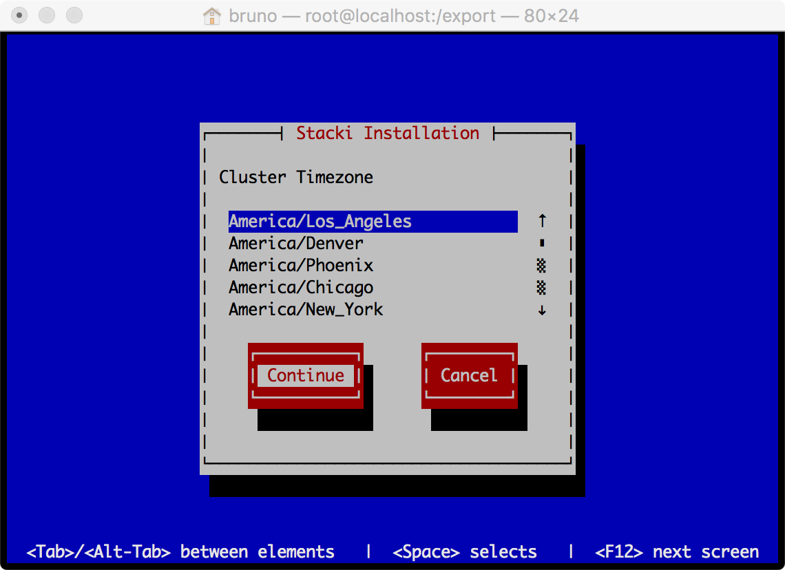
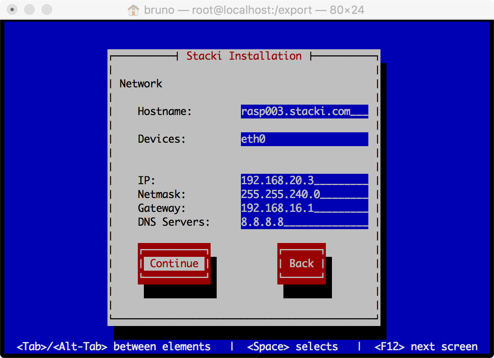
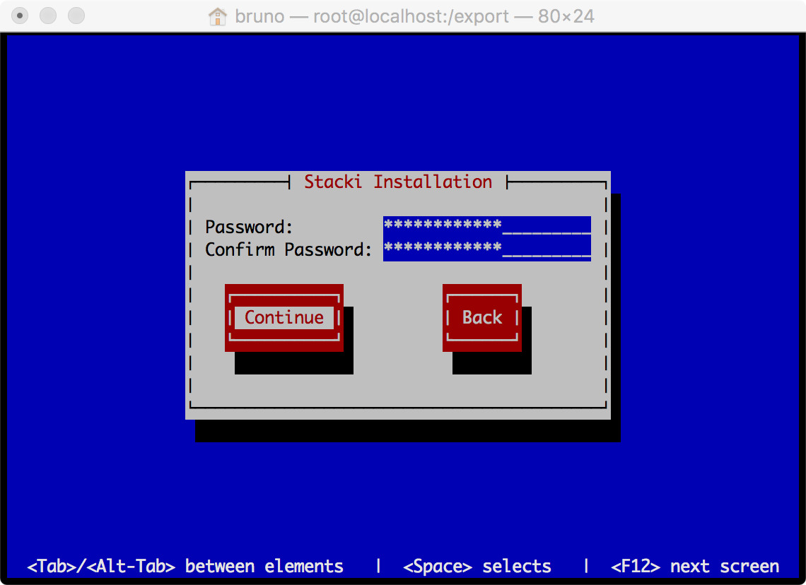
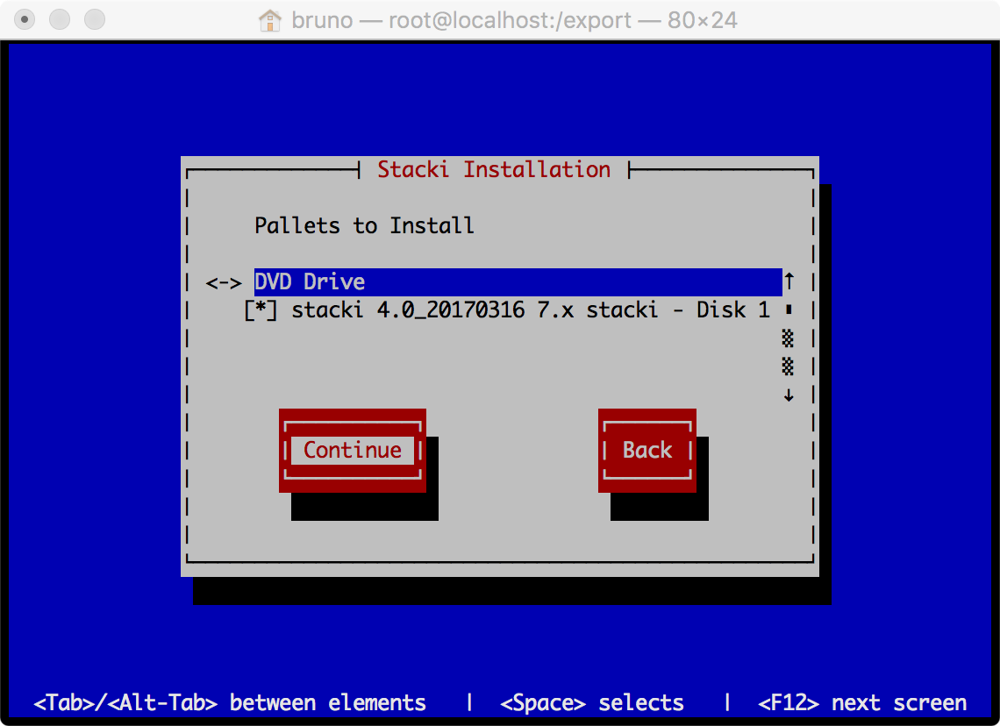
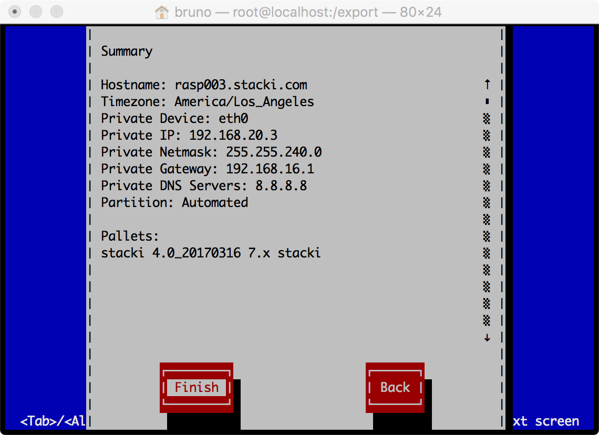

The best ARM on the team is an ACE.

---

Requirements

# Frontend

* 16 GB of storage

# Backend

* 2 GB of storage

---

# Build Frontend

* Boot Raspberry Pi that will be the frontend with `stacki-centos.img`.

* Login as `root` with the password `stacki-centos`.
** You'll be asked to change your password.

* Increase storage to full capacity:

   ```
   look up command to do this
   ```

* Reboot.

* Set the time:

  ```
  timedatectl set-timezone America/Los_Angeles
  timedatectl set-time '2017-03-14 14:53:00'
  ```

or:

  ```
  timedatectl set-timezone America/Los_Angeles
  ntpdate -s pool.ntp.org
  ```

* Copy ISOs to the frontend:

  ```
  wget os-7.3-7.x.armv7hl.disk1.iso
  wget stacki-4.0_20170316-7.x.armv7hl.disk1.iso
  wget stacki-ace-4.0_20170323-7.x.armv7hl.disk1.iso
  ```

* Apply the ``stacki`` ISO to the frontend.
** This will transform the Pi into a Stacki ACE frontend.

  ```
  wget frontend-install.py
  ```

* Execute `frontend-install.py`:

  ```
  ./frontend-install.py --stacki-iso=stacki-4.0_20170316-7.x.armv7hl.disk1.iso --stacki-version=4.0 --stacki-name=stacki
  ```











> The remainder of the install will take some time and will output a lot of
text.

* Reboot the frontend Pi

* Add/Enable the `os` pallet:

  ```
  stack add pallet os-7.3-7.x.armv7hl.disk1.iso
  stack enable pallet os
  ```

* Add/Enable the `stacki-ace` pallet:

  ```
  stack add pallet stacki-ace-4.0_20170321-7.x.armv7hl.disk1.iso
  stack enable pallet stacki-ace
  ```

* Apply the `stacki-ace` pallet to the frontend:

  ```
  stack run pallet stacki-ace | bash -x
  ```

* Load host configuration spreadsheet.

  ```
  stack load hostfile file=hosts.csv
  ```

** To see the host information, execute:

  ```
  # stack list host
  HOST    RACK RANK CPUS APPLIANCE BOX     ENVIRONMENT RUNACTION INSTALLACTION
  rasp003 0    0    4    frontend  default ----------- os        install      
  rasp004 0    4    1    ace       default ----------- os        install
  ```

In the above output `rasp003` is the frontend host and `rasp004` is the
backend host.
The appliace type for `rasp004` is **ace** which is correct appliance type
for a Raspberry Pi backend host.

* Set all the `ace` backend nodes to install:

  ```
  stack set host boot ace action=install
  ```

---

# Build Backend(s)

* Copy `stacki-centos.img` to a MicroSD card.

* Boot the backend Pi

* Enjoy your $35 dollar / node cluster!!

